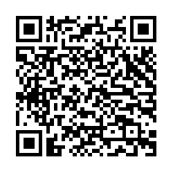

<h1 align="center">
    
     
    Breaking Bad DS
</h1>

 

*Breaking Bad*, as a Nintendo DS game, complete with 3D graphics and models. Master the art of the cook on your Nintendo DS system and prepare the perfect batch&mdash;lest you meet the wrong end of Gus. Hone your cook in both Singleplayer and Local Multiplayer Vs.

## Screenshots
<table>
<tr>
<td></td>
<td></td>
<td></td>
</tr>
<tr>
<td></td>
<td></td>
<td></td>
</tr>
</table>

## Playing
For the absolute best experience, pop the ROM on a flashcart and enjoy!

### On an Emulator
But if you're not as bothered as Walter is about doing things with the proper gear, [melonDS](https://github.com/melonDS-emu/melonDS/releases/latest) is the recommended emulator for play due to its accuracy and performance. Alternatively, the latest release of [DeSmuME](https://github.com/TASEmulators/desmume/releases/latest) is slightly easier to setup and supports [emulating rumble](#ds-rumble-pak-support).

To run this on melonDS, you'll need to go into the Emulator Config -> DLDI -> Enable DLDI, since this uses the homebrew nitrofile system.  I reccommend the Software video emulator for best results to make the models pop, as the OpenGL backend doesn't quite support the DS's hardware-accellerated outlines just yet.

You can also run this on a modded DSi or 3DS with Twilight Menu++ (other game loaders have not been tested). You can download the game ROM by scanning the QR code below in your loader's menu, if your system supports this. Please make sure you use v1.0.3+, or your game may crash on startup!

Download ROM QR code (v1.0.3)

### Unsupported platforms
Sorry, this *won't work on the Wii U Virtual Console emulator*. I'm sorry to ruin your dreams. If you run this on a cool setup, take a picture and [email me](mailto:will27528+brbads@gmail.com).

## Instructions
### Tutorial (1P)
The Tutorial will teach you how to play! Gale will provide instructions on how to complete each Minigame. To access the Tutorial, select it from the Main Menu.

### Story Mode (1P)
To start story mode, start the game. Touch to start, then tap "Start Game → Story Mode."

Gus has appointed you Head Cook! Meet his ever-increasing demands by cooking against the clock in the Superlab. Each day, you'll be given a Quota you must complete within a set time limit to progress on to the next day. After each day, you'll receive your pay packet based on your performance and efficiency, which you can spend in Saul's shop!

Story mode lasts five days, and there are two possible endings ("Good" and "Bad"). Good luck!

**About save data:** Story progress is not saved after powering off the Nintendo DS system or emulator due to LibFAT not working correctly on most flash carts. Some flash carts do support saving, however, and the game will attempt to save your progress to your SD card. Making save states is reccommended if you're using an emulator!

### Local Multiplayer (2P)
Breaking Bad for Nintendo DS also supports up to two Nintendo DS systems playing together in a Multiplayer Vs. Battle to see who can complete their batches the quickest. You can emulate this through multiple instances on MelonDS currently, or run on hardware with two systems and two flashcarts. To set this up:

* On the first system, launch the game. Touch to start, then tap "Start Game → Host."
* If you're using MelonDS: On the menu bar, select "System → Multiplayer → Launch new instance" and open the ROM.
* On the second system/new MelonDS instance, launch the game, touch to start, then tap "Start Game → Join."
* Wait for the systems to establish communications.
* On the Host console, press the A Button to start the game.

The Host system will play as Walter, while the guest will play as Jesse. The magic that makes it work is thanks to the incredible [Fewnity](https://github.com/Fewnity/Nintendo-DS-Nifi-Template/)'s amazing NiFi scaffold!

### Hank's Minerals
By completing certain challenges, you'll find minerals! Hank will appraise minerals you find in the "Hank's Minerals" submenu, located in the Extras Menu. There are twelve minerals to find, and you can view how to get them by tapping on each `[?]` icon in the menu.

Once you've obtained a mineral, it will be displayed in the menu and selecting it will tell you what it is. Minerals marked with "??????" are a secret, so no hints there!

### Music Player
You can listen to the game music through the Music Player submenu, located in the Extras menu. Use the left and right buttons on the + Control Pad to change the track.

### DS Rumble Pak support
This game supports the [Nintendo DS Rumble Pak](https://en.wikipedia.org/wiki/Rumble_Pak#Nintendo_DS)! DeSMuME (but not Melon, sadly) supports emulating this &mdash; or you can insert a physical SLOT-2 DS Rumble Pak accessory on an original DS/DS Lite. If you're shopping for this accessory, you can often find it cheaper bundled with certain games, such as "actionloop" in Europe.

## Building
### General instructions
devKitARM, NFLib and Nitro-Engine must be installed. Then, just run `make` following to build a `.nds` ROM file.

### Asset preparation
There's scripts for converting the various assets and moving them into the correct nitrofiles directories. Run `bash ./convert.sh` inside `graphics/sprite` for instance to automatically prepare all the sprite images. If you've updated the graphics, delete the `build/` directory before building.

## License
The source code for this project is licensed under Apache-2.0, except otherwise stated. For more information, see [LICENSE](https://github.com/WiIIiam278/breaking-bad-ds/blob/main/LICENSE).

For attribution information on the various resources I used, please see [ATTRIBUTION.md](https://github.com/WiIIiam278/breaking-bad-ds/blob/main/ATTRIBUTION.md).
